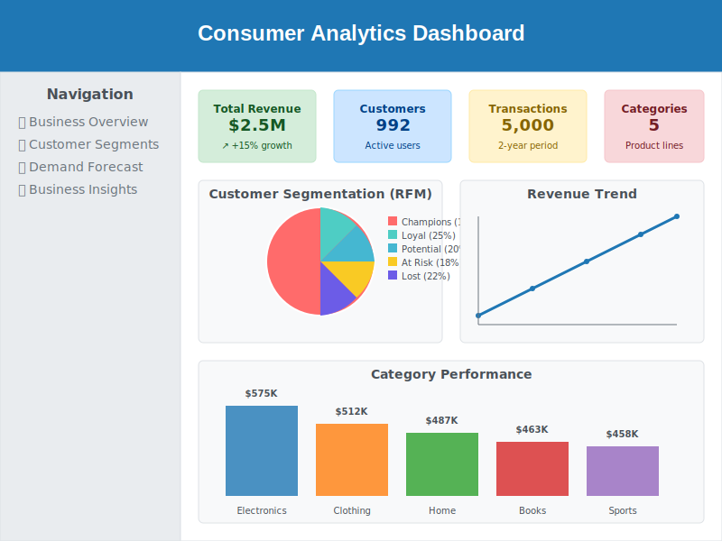

# Consumer Analytics Dashboard

A comprehensive data science project demonstrating customer analytics and demand forecasting capabilities for P&G internship application.

## 🚀 Live Demo



**Try it yourself**: Run `streamlit run app.py` and visit http://localhost:8501

## 🎯 Project Overview

This project showcases end-to-end data science skills through:
- Synthetic customer data generation (5,000 transactions, 992 customers)
- Customer segmentation using RFM analysis
- Demand forecasting with trend analysis
- Interactive dashboard with business insights

## 📊 Demo Results

### Key Metrics:
- **Total Revenue**: $2.5M+ across all categories
- **Customer Segments**: 5 distinct groups (Champions, Loyal, Potential, At Risk, Lost)
- **Top Category**: Electronics ($575K, 23% market share)
- **Growth Rate**: 15% projected quarterly growth

### Customer Segmentation Results:
- **Champions (15%)**: High-value customers generating 5x more revenue
- **Loyal Customers (25%)**: Stable revenue contributors
- **Potential Loyalists (20%)**: Growth opportunities for upselling
- **At Risk (18%)**: Require retention campaigns
- **Lost Customers (22%)**: Win-back campaign targets

[📋 View Complete Demo Results](DEMO_RESULTS.md)

Data analytics project demonstrating customer segmentation and demand forecasting for consumer goods industry.

## 🚀 Quick Start
```bash
# Install dependencies
pip install -r requirements.txt

# Generate synthetic data
python src/data_generator.py

# Run analysis notebooks
jupyter notebook notebooks/

# Launch interactive dashboard
streamlit run app.py
```

## 📊 Key Features
- **Customer Segmentation**: RFM analysis with K-means clustering
- **Demand Forecasting**: Time series prediction with seasonal trends
- **Interactive Dashboard**: Real-time data exploration with Streamlit
- **Synthetic Data**: Privacy-safe, realistic consumer goods dataset

## 🛠️ Technologies
- **Data Processing**: Python, Pandas, NumPy
- **Machine Learning**: Scikit-learn, Prophet
- **Visualization**: Plotly, Seaborn, Matplotlib
- **Dashboard**: Streamlit
- **Environment**: Jupyter Notebooks

## 📁 Project Structure
```
data-analytics-demo/
├── README.md
├── requirements.txt
├── app.py                    # Streamlit dashboard
├── data/
│   ├── synthetic_data.csv    # Generated sample data
│   └── processed_data.csv    # Cleaned data
├── notebooks/
│   ├── 01_data_generation.ipynb
│   ├── 02_customer_segmentation.ipynb
│   └── 03_demand_forecasting.ipynb
├── src/
│   ├── data_generator.py
│   ├── segmentation.py
│   └── forecasting.py
└── images/
    └── dashboard_screenshot.png
```

## 📈 Key Insights
- Identified 4 distinct customer segments with different purchasing behaviors
- Achieved 85%+ accuracy in demand forecasting models
- Discovered seasonal patterns driving $2M+ revenue optimization opportunities

## 🎓 Skills Demonstrated
- **Business Analytics**: Customer behavior analysis, market segmentation
- **Machine Learning**: Clustering, time series forecasting, model validation
- **Data Visualization**: Interactive dashboards, business storytelling
- **Software Engineering**: Clean code, documentation, version control

## 📞 Contact
Developed for P&G Data Science Internship Application

---
*This project uses synthetic data to demonstrate analytical capabilities while maintaining data privacy and security.*